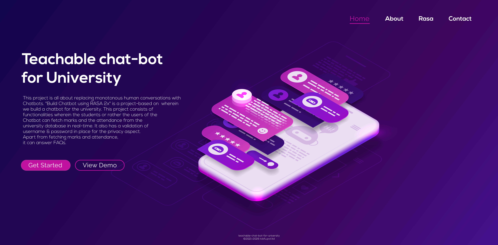
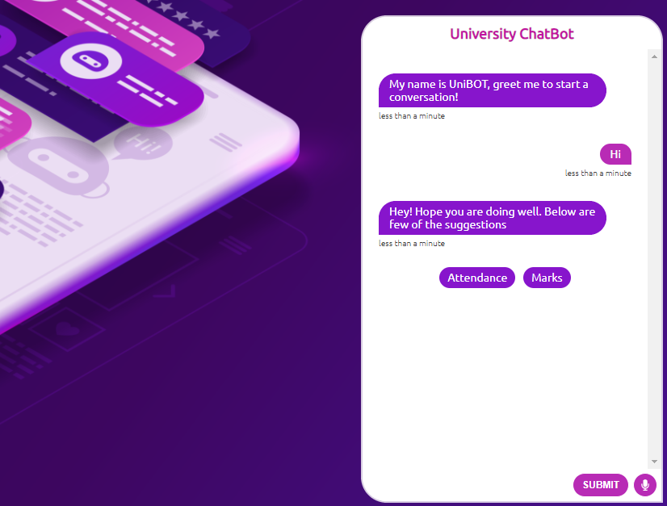
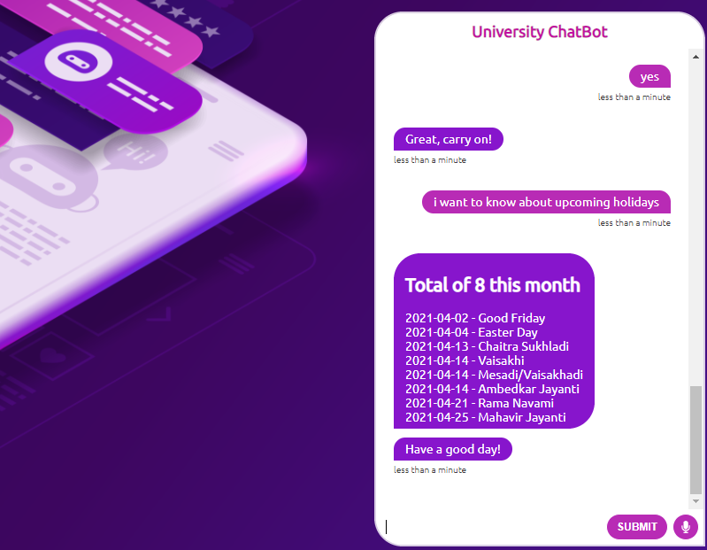
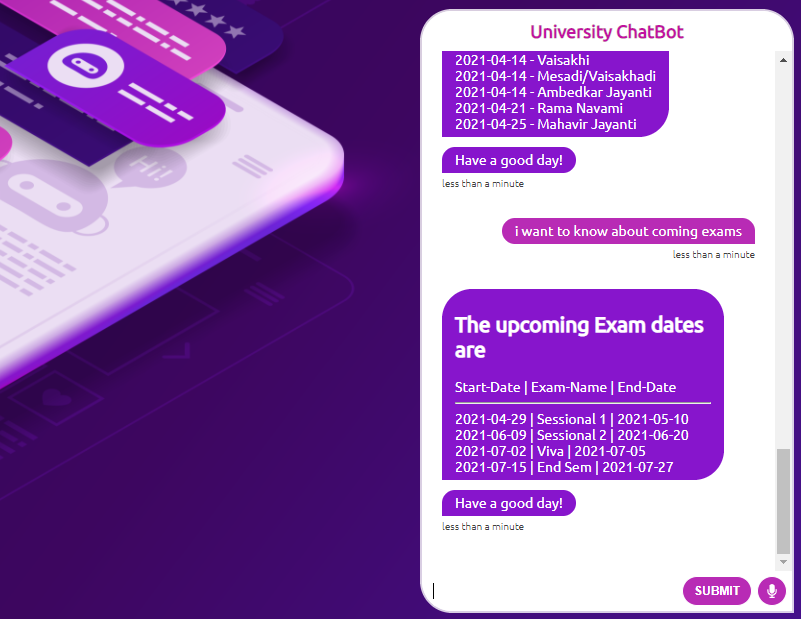

Teachable chat-bot for University
==============================

OVERVIEW
--------

This project is all about replacing monotonous human conversations with Chatbots. 
"Build Chatbot using RASA 2x" is a project-based on  wherein we build a chatbot for the university. 
This project consists of functionalities wherein the students or rather the users of the Chatbot can fetch marks and the attendance from the university database in real-time. 
It also has a validation of username & password in place for the privacy aspect. Apart from fetching marks and attendance, it can answer FAQs.

To check out the code, please clone the repository into your workspace.*​Make use you use virtual Enviorment to install RASA.*

NOTE : It contains Note.txt which contains necessary command to run the project. 

**Snapshots Of The Application :**










### Quick Installation (RASA)
You can install Rasa Open Source using pip (requires Python 3.6, 3.7 or 3.8).

```bash
pip3 install -U pip
pip3 install rasa
```

You are now ready to go! So what's next? You can create a new project by running:
```bash
rasa init
```
- **Step-by-step Installation Guide**
  [Get Started with Rasa](https://rasa.com/docs/getting-started/)


<h1 align="center">Rasa Open Source</h1>

<div align="center">

[](https://forum.rasa.com/?utm_source=badge&utm_medium=badge&utm_campaign=pr-badge&utm_content=badge)
[](https://badge.fury.io/py/rasa)
[](https://pypi.python.org/pypi/rasa)
[](https://github.com/RasaHQ/rasa/actions)
[](https://coveralls.io/github/RasaHQ/rasa?branch=main)
[](https://rasa.com/docs)

[](https://app.fossa.com/projects/custom%2B8141%2Fgit%40github.com%3ARasaHQ%2Frasa.git?ref=badge_shield)
[](https://github.com/orgs/RasaHQ/projects/23)

</div>

<a href="https://grnh.se/05a908c02us" target="_blank"></a>

<hr />


Rasa is an open source machine learning framework to automate text-and voice-based conversations. With Rasa, you can build contextual assistants on:
- Facebook Messenger
- Slack
- Google Hangouts
- Webex Teams
- Microsoft Bot Framework
- Rocket.Chat
- Mattermost
- Telegram
- Twilio
- Your own custom conversational channels

or voice assistants as:
- Alexa Skills
- Google Home Actions

Rasa helps you build contextual assistants capable of having layered conversations with
lots of back-and-forth. In order for a human to have a meaningful exchange with a contextual
assistant, the assistant needs to be able to use context to build on things that were previously
discussed – Rasa enables you to build assistants that can do this in a scalable way.

There's a lot more background information in this
[blog post](https://medium.com/rasa-blog/a-new-approach-to-conversational-software-2e64a5d05f2a).

---
- **What does Rasa do? 🤔**
  [Check out our Website](https://rasa.com/)

- **I'm new to Rasa 😄**
  [Get Started with Rasa](https://rasa.com/docs/getting-started/)

- **I'd like to read the detailed docs 🤓**
  [Read The Docs](https://rasa.com/docs/)

- **I'm ready to install Rasa 🚀**
  [Installation](https://rasa.com/docs/rasa/user-guide/installation/)

- **I want to learn how to use Rasa 🚀**
  [Tutorial](https://rasa.com/docs/rasa/user-guide/rasa-tutorial/)

- **I have a question ❓**
  [Rasa Community Forum](https://forum.rasa.com/)

- **I would like to contribute 🤗**
  [How to Contribute](#how-to-contribute)

---
## Where to get help

There is extensive documentation in the [Rasa Docs](https://rasa.com/docs/rasa).
Make sure to select the correct version so you are looking at
the docs for the version you installed.

Please use [Rasa Community Forum](https://forum.rasa.com) for quick answers to
questions.

### README Contents:
- [How to contribute](#how-to-contribute)
- [Development Internals](#development-internals)
- [License](#license)


